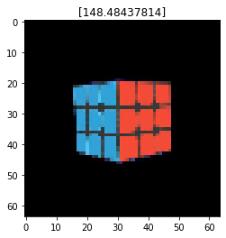

# Rubik-s-Cube-Rotation-Prediction
Predicting the X-Axis Rotation for a give rubik`s cube. (AI CROWD Hackathon)

  .png)

- This was part of the AI Blitz Challenge by hosted byAI Crowd. 
- I have used Resnet50 Architecture to predict the rotation of a Rubik`s cube given images of various cubes in different angles. 
- The final MSE on test dataset was 0.236, we ranked <b>9th</b> in the competition. 
https://www.aicrowd.com/challenges/aicrowd-blitz-may-2020/problems/orientme/leaderboards
